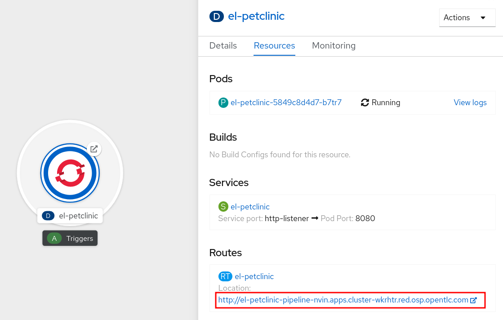
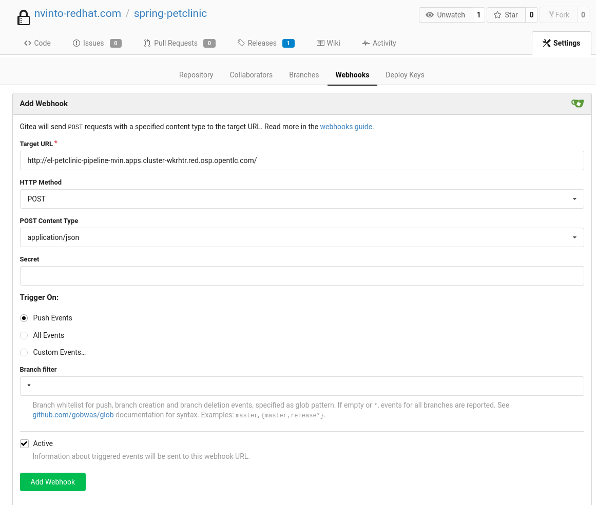
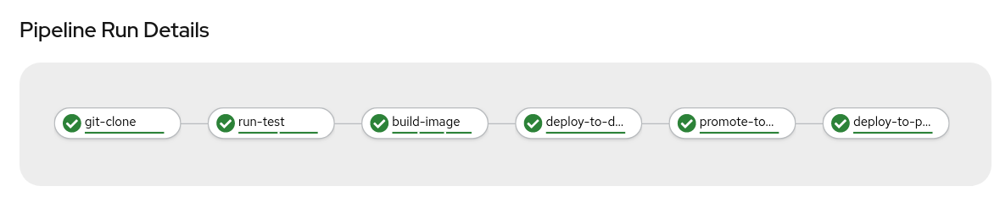

:markup-in-source: verbatim,attributes,quotes

// Title comes from the workshop.yaml
// == Adding Triggers to the Pipeline

Most Git repository servers support the concept of web hooks -- calling to an
external source via HTTP(S) when a change in the code repository happens.
OpenShift provides an API endpoint that supports receiving hooks from
remote systems in order to trigger builds. By pointing the code repository's
hook at the OpenShift Pipelines resources, automated code/build/deploy pipelines can be achieved.

While Jenkins Pipelines were defined as `BuildConfig` with their webhook URLs, Tekton Pipelines have their own mechanism for that called `Trigger`.

Tekton link:https://github.com/tektoncd/triggers[Triggers] enable us to configure Pipelines to respond to external events (Git push events, pull requests etc) such as Web Hooks.

Adding triggering support requires the creation of a `TriggerTemplate`, `TriggerBinding`, and an `EventListener` in our project.

image::images/devops-pipeline-triggers.png[Triggers]

Let's see each component in detail:

* *TriggerTemplate*: a trigger template is a template for newly created resources. It supports parameters to create specific `PipelineResources` and `PipelineRuns`.
* *TriggerBinding*: validates events and extracts payload fields
* *EventListener*: connects `TriggerBindings` and `TriggerTemplates` into an addressable endpoint (the event sink). It uses the extracted event parameters from each TriggerBinding (and any supplied static parameters) to create the resources specified in the corresponding TriggerTemplate. It also optionally allows an external service to pre-process the event payload via the interceptor field.

Let's review our component that we can create either from Web Console than command line:

[source,yaml,role=copypaste]
----
apiVersion: triggers.tekton.dev/v1alpha1
kind: TriggerTemplate
metadata:
  name: petclinic
spec:
  params:
  - name: git-revision
  - name: git-commit-message
  - name: git-repo-url
  - name: git-repo-name
  - name: content-type
  - name: pusher-name
  resourcetemplates:
  - apiVersion: tekton.dev/v1beta1
    kind: PipelineRun
    metadata:
      labels:
        tekton.dev/pipeline: petclinic-pipeline
      name: petclinic-deploy-$(uid)
    spec:
      params:
      - name: APP_NAME
        value: petclinic
      - name: APP_GIT_URL
        value: $(params.git-repo-url)
      - name: APP_GIT_REVISION
        value: $(params.git-revision)
      pipelineRef:
        name: petclinic-pipeline
      workspaces:
      - name: app-source
        persistentVolumeClaim:
          claimName: app-source-pvc
      - name: maven-settings
        emptyDir: {}
----

[source,yaml,role=copypaste]
----
apiVersion: triggers.tekton.dev/v1alpha1
kind: TriggerBinding
metadata:
  name: petclinic
spec:
  params:
  - name: git-repo-url
    value: $(body.repository.clone_url)
  - name: git-repo-name
    value: $(body.repository.name)
  - name: git-revision
    value: $(body.after)
----

[source,yaml,role=copypaste]
----
apiVersion: triggers.tekton.dev/v1alpha1
kind: EventListener
metadata:
  name: petclinic
spec:
  serviceAccountName: pipeline
  triggers:
  - bindings:
    - name: petclinic
    template:
      name: petclinic
----

[source,yaml,role=copypaste]
----
apiVersion: route.openshift.io/v1
kind: Route
metadata:
  labels:
    app.kubernetes.io/managed-by: EventListener
    app.kubernetes.io/part-of: Triggers
    eventlistener: petclinic
  name: el-petclinic
spec:
  port:
    targetPort: 8080
  to:
    kind: Service
    name: el-petclinic
    weight: 100
----

Let's create them all:

[source,bash,subs="{markup-in-source}",role=execute]
----
oc create -f https://raw.githubusercontent.com/redhat-gpte-labs/rhtr2020_pipelines/master/workshop/content/tekton/triggers/petclinic-triggers.yaml -n pipeline-%guid%
----

You should see now a new Deployment for the *EventListener* `el-petclinic` has been created:
[source,bash,subs="{markup-in-source}",role=execute]
----
oc get deployment -n pipeline-%guid%
----

Also from Web Console, you should see a new Deployment `el-petclinic`. From there, copy `el-petclinic` Route we will use to configure a Webhook inside Gitea.

Or get it from the CLI:

[source,bash,subs="{markup-in-source}",role=execute]
----
oc get route el-petclinic -n pipeline-%guid%
----

== Configure Webhook in Gitea

Once you copied the Route URL for the `EventListener`, go to %gitea_url% and access with your credentials *%ocp_username%* and *%gitea_password%*.

After you logged in successfully, navigate to Gitea tabs and select from top right *Settings*, then select *Webhooks* tab. Then from top-right click on *Add Webhook* and select *Gitea* type.

Add:
- *Target URL*: the URL you copied from previous Route
- *HTTP Method*: POST
- *POST Content Type*: application/json
- *Secret*: leave it blank

Click on *Add Webhook*.

== Trigger it!

Let's change something in the source code to start automatically our Pipeline.
From project home in Gitea, navigate the code to `spring-petclinic / src / main / resources / messages /` and edit `message.properties`.

Let's change `Line 1` from:

[source,text,subs="{markup-in-source}"]
----
welcome=Welcome
----

To:

[source,text,subs="{markup-in-source}", role=copypaste]
----
welcome=Welcome to RHTR!
----

Click *Commit Changes* to commit and push changes.

Now the EventListener should have been invoked through the Route we setup inside Gitea Webhooks and thus a new pipeline should have started.

You can verify it from CLI:

[source,bash,subs="{markup-in-source}",role=execute]
----
tkn pipeline ls -n pipeline-%guid%
----

Get logs from the running pipeline, select latest one:

[source,bash,subs="{markup-in-source}",role=execute]
----
tkn pipeline logs -n pipeline-%guid%
----

Or from Web Console, from left-side menu click *Pipelines* and then *petclinic-pipeline* to see running *PipelineRuns*.

When the Pipeline has completed with success, verify the new changes from *pipeline-%guid%-dev* and *pipeline-%guid%-prod* projects, clicking on Routes showing your changes deployed.

[source,bash,subs="{markup-in-source}",role=execute]
----
oc get pod -n petclinic-%guid%-dev
----

[source,bash,subs="{markup-in-source}",role=execute]
----
oc get pod -n petclinic-%guid%-prod
----

[source,bash,subs="{markup-in-source}",role=execute]
----
oc get routes -n petclinic-%guid%-dev
----

[source,bash,subs="{markup-in-source}",role=execute]
----
oc get routes -n petclinic-%guid%-prod
----

You should see some beauty pets greetings here from RHTR :)

image::images/webhook_successful.png[Webhook successful]

== Summary

Congratulations!

You have converted a Pipeline from Jenkins to Tekton and learned what are the steps in order to do it. Now you are ready to spread the coolest Kubernetes CI/CD system with OpenShift and OpenShift Pipelines!
