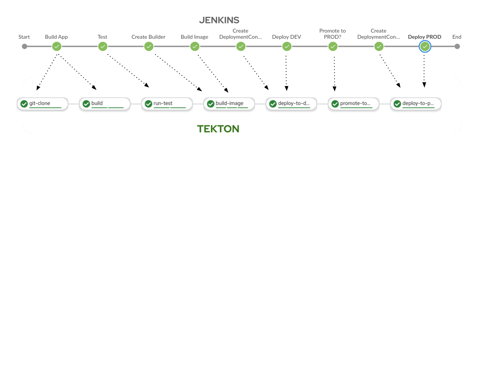
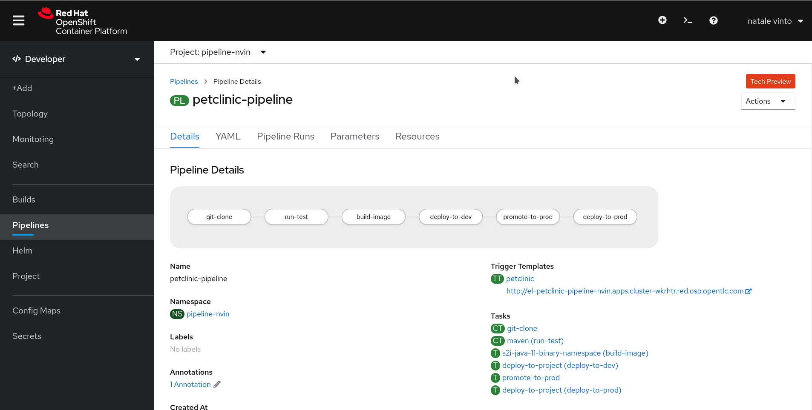

:GUID: %guid%
:OCP_USERNAME: %ocp_username%
:markup-in-source: verbatim,attributes,quotes

== OpenShift Pipeline

OpenShift Pipelines is a cloud-native, continuous integration and delivery (CI/CD) solution for building pipelines using https://tekton.dev/[Tekton]. Tekton is a flexible, Kubernetes-native, open-source CI/CD framework that enables automating deployments across multiple platforms (Kubernetes, serverless, VMs, etc) by abstracting away the underlying details.

=== Understanding OpenShift Pipelines

Tekton defines a number of https://kubernetes.io/docs/concepts/extend-kubernetes/api-extension/custom-resources/[Kubernetes custom resources] as building blocks in order to standardize pipeline concepts and provide a terminology that is consistent across CI/CD solutions. 

The custom resources needed to define a pipeline are listed below:

* `Task`: a reusable, loosely coupled number of steps that perform a specific task (e.g. building a container image)
* `Pipeline`: the definition of the pipeline and the `Tasks` that it should perform
* `TaskRun`: the execution and result of running an instance of task
* `PipelineRun`: the execution and result of running an instance of pipeline, which includes a number of `TaskRuns`

image::https://raw.githubusercontent.com/openshift/pipelines-tutorial/master/docs/images/tekton-architecture.svg[Tekton Architecture]

In short, in order to create a pipeline, one does the following:

* Create custom or install https://github.com/tektoncd/catalog[existing] reusable `Tasks`
* Create a `Pipeline` and `PipelineResources` to define your application's delivery pipeline
* Create a `PersistentVolumeClaim` to provide the volume/filesystem for pipeline execution or provide a `VolumeClaimTemplate` which creates a `PersistentVolumeClaim`
* Create a `PipelineRun` to instantiate and invoke the pipeline

For further details on pipeline concepts, refer to the https://github.com/tektoncd/pipeline/tree/master/docs#learn-more[Tekton documentation] that provides an excellent guide for understanding various parameters and attributes available for defining pipelines.

The installation of OpenShift Pipeline have been already made for you in this cluster usingthe OpenShift Pipeline Operator.

=== From Jenkins to Tekton

In this chapter we will convert the Groovy Jenkins Pipeline we run in the previous chapter, into a Kubernetes-native YAML Tekton Pipeline.

In order to achieve that, we will refactor all the steps from our original Pipeline into a new list of steps that better fit our new format.

Let's use our Pipeline project pipeline-%guid% :

[source,bash,subs="{markup-in-source}",role=execute]
----
oc project pipeline-%guid%
----

==== Stages to Tasks

All Jenkins `Stages` will be converted into Tekton `Tasks` or `ClusterTasks`. A ClusterTask is a Tekton Task available for the whole cluster, and OpenShift Pipelines come with a list of them useful for many common use cases.

You can verify the list of available reusable ClusterTasks:

[source,bash,subs="{markup-in-source}",role=execute]
----
oc get ClusterTasks
----

For this exercise, we need two of them:

* *git-clone*: it downloads the source code from Git Repositories, we will use it for this purpose with our private Git Repository from Gitea
* *maven*: it performs Maven builds with target Maven Goals, we will use it to run our test and our builds with Maven

All the other `Stages` will be converted with some custom `Tasks` we are going to define now:

* *s2i-java-11-binary-namespace*: a Task to build a container image from the artifact generated by a previous Maven ClusterTask, and then push it to a target namespace. For our purpose we need to push it to a _dev_ and a _prod_ project like before.
* *promote-to-prod*: a Task to tag our _dev_ image to _prod_ thus promoting it to the _prod_ project 
* *deploy-to-project*: a Task to deploy an existing container image to a target project. We will use it to deploy the app to our _dev_ and _prod_ environments

Let's create them:

[source,bash,subs="{markup-in-source}",role=execute]
----
oc create -f https://raw.githubusercontent.com/rhtr2020_pipelines/master/workshop/content/tekton/tasks/ -n pipeline-%guid%
----

Now let's review the 3 tasks we just created:

[source,bash,subs="{markup-in-source}",role=execute]
----
oc get Tasks -n pipeline-%guid%
----

We should see something similar:

.Sample Output
[source,options="nowrap",subs="{markup-in-source}"]
----
NAME                           AGE
deploy-to-project              10s
promote-to-prod                10s
s2i-java-11-binary-namespace   10s
----

Let's explore them, you can do this either from link:
%web_console_url%[Web Console] than command line:

[source,bash,subs="{markup-in-source}",role=execute]
----
oc get Tasks -o yaml -n -n pipeline-%guid%
----

You can do the same thing for the ClusterTasks:

[source,bash,subs="{markup-in-source}",role=execute]
----
oc get ClusterTasks git-clone -o yaml
----

[source,bash,subs="{markup-in-source}",role=execute]
----
oc get ClusterTasks maven -o yaml
----

Now we have all the components that we can connect to create our Tekton Pipeline, and this can be done through a `Pipeline` object.

Let's review our Pipeline YAML content:

[source,yaml,subs="{markup-in-source}",role=copypaste]
----
apiVersion: tekton.dev/v1beta1
kind: Pipeline
metadata:
  name: petclinic-pipeline
spec:
  params:
    - default: spring-petclinic
      description: The application deployment name
      name: APP_NAME
      type: string
    - default: >-
        %gitea_url%
      description: The application git repository url
      name: APP_GIT_URL
      type: string
    - default: main
      description: The application git repository revision
      name: APP_GIT_REVISION
      type: string
    - default: 'spring-petclinic:latest'
      description: The application image stream
      name: APP_IMAGE_STREAM
      type: string
    - default: petclinic-%guid%-dev
      name: DEV_NAMESPACE
      type: string
    - default: petclinic-%guid-prod
      name: PROD_NAMESPACE
      type: string
  tasks:
    - name: git-clone
      params:
        - name: url
          value: $(params.APP_GIT_URL)
        - name: revision
          value: $(params.APP_GIT_REVISION)
        - name: deleteExisting
          value: 'true'
      taskRef:
        kind: ClusterTask
        name: git-clone
      workspaces:
        - name: output
          workspace: app-source
    - name: run-test
      params:
        - name: GOALS
          value:
            - package
      runAfter:
        - git-clone
      taskRef:
        kind: ClusterTask
        name: maven
      workspaces:
        - name: source
          workspace: app-source
        - name: maven-settings
          workspace: maven-settings
    - name: build-image
      params:
        - name: TLSVERIFY
          value: 'false'
        - name: OUTPUT_IMAGE_STREAM
          value: $(params.APP_IMAGE_STREAM)
        - name: NAMESPACE
          value: $(params.DEV_NAMESPACE)
      runAfter:
        - run-test
      taskRef:
        kind: Task
        name: s2i-java-11-binary-namespace
      workspaces:
        - name: source
          workspace: app-source
    - name: deploy-to-dev
      params:
        - name: DEPLOYMENT
          value: $(params.APP_NAME)
        - name: IMAGE_STREAM
          value: $(params.APP_IMAGE_STREAM)
        - name: NAMESPACE
          value: $(params.DEV_NAMESPACE)
      runAfter:
        - build-image
      taskRef:
        kind: Task
        name: deploy-to-project
    - name: promote-to-prod
      params:
        - name: IMAGE_STREAM
          value: $(params.APP_IMAGE_STREAM)
        - name: DEPLOYMENT
          value: $(params.APP_NAME)
        - name: DEV_NAMESPACE
          value: $(params.DEV_NAMESPACE)
        - name: PROD_NAMESPACE
          value: $(params.PROD_NAMESPACE)
      runAfter:
        - deploy-to-dev
      taskRef:
        kind: Task
        name: promote-to-prod
    - name: deploy-to-prod
      params:
        - name: DEPLOYMENT
          value: $(params.APP_NAME)
        - name: IMAGE_STREAM
          value: '$(params.APP_NAME):prod'
        - name: NAMESPACE
          value: $(params.PROD_NAMESPACE)
      runAfter:
        - promote-to-prod
      taskRef:
        kind: Task
        name: deploy-to-project
  workspaces:
    - name: app-source
    - name: maven-settings
----

If you observe the code, Tekton Pipelines accepts some parameters like Jenkins Pipelines, then they define all requires steps as a sequence of Task to run. Those steps can be executed sequentially or in parallel, and they can share some storage defined as `Workspace`.

NOTE: One big difference between Jenkins and Tekton pipelines is the agent/executor. While in Jenkins it's just one pod, scheduled by the Kubernetes Plugin, executing all the steps, with Tekton, being a native extension of Kubernetes, there are many pods involved in the setup/execution. Each step, within the same Pipeline, it's executed by a different pod. That's why we need a shared volume to let the `git-clone` Task to communicate with the `maven` Task and the others. Proper the workspaces.

Let' create some storage for our `Workspace` that we will call `app-source`:

[source,bash,subs="{markup-in-source}",role=execute]
----
oc create -f https://raw.githubusercontent.com/rhtr2020_pipelines/master/workshop/content/tekton/pvc/workspace-pvc.yaml -n pipeline-%guid%
----

After that, we can create our Pipeline inside pipeline-%guid% project. We can do either from Web Console pasting the above YAML content, left-side menu *Add+* -> *YAML* , or directly from CLI here:

[source,bash,subs="{markup-in-source}",role=execute]
----
cat <<'EOF' | oc apply -f -
apiVersion: tekton.dev/v1beta1
kind: Pipeline
metadata:
  name: petclinic-pipeline
spec:
  params:
    - default: spring-petclinic
      description: The application deployment name
      name: APP_NAME
      type: string
    - default: >-
        %gitea_url%
      description: The application git repository url
      name: APP_GIT_URL
      type: string
    - default: main
      description: The application git repository revision
      name: APP_GIT_REVISION
      type: string
    - default: 'spring-petclinic:latest'
      description: The application image stream
      name: APP_IMAGE_STREAM
      type: string
    - default: petclinic-%guid%-dev
      name: DEV_NAMESPACE
      type: string
    - default: petclinic-%guid-prod
      name: PROD_NAMESPACE
      type: string
  tasks:
    - name: git-clone
      params:
        - name: url
          value: $(params.APP_GIT_URL)
        - name: revision
          value: $(params.APP_GIT_REVISION)
        - name: deleteExisting
          value: 'true'
      taskRef:
        kind: ClusterTask
        name: git-clone
      workspaces:
        - name: output
          workspace: app-source
    - name: run-test
      params:
        - name: GOALS
          value:
            - package
      runAfter:
        - git-clone
      taskRef:
        kind: ClusterTask
        name: maven
      workspaces:
        - name: source
          workspace: app-source
        - name: maven-settings
          workspace: maven-settings
    - name: build-image
      params:
        - name: TLSVERIFY
          value: 'false'
        - name: OUTPUT_IMAGE_STREAM
          value: $(params.APP_IMAGE_STREAM)
        - name: NAMESPACE
          value: $(params.DEV_NAMESPACE)
      runAfter:
        - run-test
      taskRef:
        kind: Task
        name: s2i-java-11-binary-namespace
      workspaces:
        - name: source
          workspace: app-source
    - name: deploy-to-dev
      params:
        - name: DEPLOYMENT
          value: $(params.APP_NAME)
        - name: IMAGE_STREAM
          value: $(params.APP_IMAGE_STREAM)
        - name: NAMESPACE
          value: $(params.DEV_NAMESPACE)
      runAfter:
        - build-image
      taskRef:
        kind: Task
        name: deploy-to-project
    - name: promote-to-prod
      params:
        - name: IMAGE_STREAM
          value: $(params.APP_IMAGE_STREAM)
        - name: DEPLOYMENT
          value: $(params.APP_NAME)
        - name: DEV_NAMESPACE
          value: $(params.DEV_NAMESPACE)
        - name: PROD_NAMESPACE
          value: $(params.PROD_NAMESPACE)
      runAfter:
        - deploy-to-dev
      taskRef:
        kind: Task
        name: promote-to-prod
    - name: deploy-to-prod
      params:
        - name: DEPLOYMENT
          value: $(params.APP_NAME)
        - name: IMAGE_STREAM
          value: '$(params.APP_NAME):prod'
        - name: NAMESPACE
          value: $(params.PROD_NAMESPACE)
      runAfter:
        - promote-to-prod
      taskRef:
        kind: Task
        name: deploy-to-project
  workspaces:
    - name: app-source
    - name: maven-settings
EOF
----

You can now review it also from Web Console, toggle *Developer Perspective*, select your project pipeline-%guid%, go to left-side menu, click *Pipelines* and you should see a new one named *spring-petclinic*.

Verify it also from command line:

[source,bash,subs="{markup-in-source}",role=execute]
----
oc get Pipeline -n *pipeline-%guid%
----

=== tkn: Tekton CLI 

Tekton has its own CLI for managing pipelines, you can try it from here:

[source,bash,subs="{markup-in-source}",role=execute]
----
tkn version
----

Check our pipeline:

[source,bash,subs="{markup-in-source}",role=execute]
----
tkn pipeline list -n pipeline-%guid%
----

