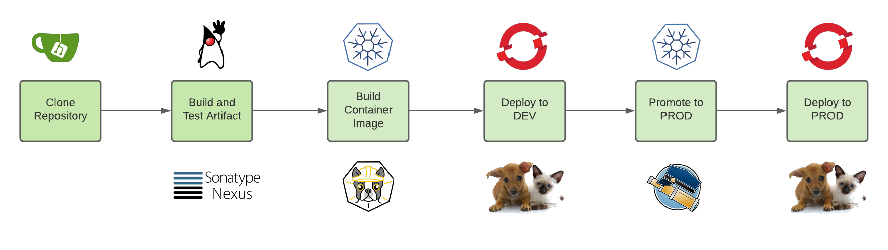

:markup-in-source: verbatim,attributes,quotes

// Title comes from the workshop.yaml
// == Overview

*Welcome to Red Hat Tech Ready 2020 and the Lab "From Jenkins to OpenShift Pipelines (Tekton)"!*

link:https://www.jenkins.io[Jenkins] has been the de-facto standard for CI/CD for multiple years now. In recent additions Jenkins gained the capability to build pipelines, first in Groovy, then in declarative syntax.

Despite the fact that Jenkins has been quite successful in the marketplace it does not really offer a Kubernetes native experience to write and deploy applications on Kubernetes platforms (including Red Hat OpenShift). While there are a few additions to Jenkins - like builder agent pods - Jenkins is still a rather heavy application that needs to be managed and cared for.

Therefore a cross-company team created the Tekton Open Source Project to offer a Kubernetes Native experience for CI/CD on top of Kubernetes.

link:https://tekton.dev[Tekton] offers Cloud Native CI/CD:

Cloud-native CI/CD refers to CI/CD systems that follow three principles:

* *Containers*: they are build for containerized apps and environment and run well on Kubernetes 
* *Serverless*: run and scale on demand without the need for a central CI engine to be maintained and taken care of
* *DevOps*: they are built with DevOps practices in mind and allow teams to own their delivery pipelines alongside the applications without having to rely on central center of excellence teams that manage delivery pipelines on other teams behalf.

See https://tekton.dev and https://github.com/tektoncd/pipeline for more information about Tekton.

*OpenShift Pipelines* is the Red Hat supported version of Tekton. It is installed and maintained on OpenShift Container Platform via an Operator.

== Lab Overview

In this lab, you will convert an existing Jenkins pipeline into an OpenShift pipeline based on Tekton.

In order to provide a real use case to work with, Pipelines are using a private repository (Gitea), hosting a Spring boot app (link:https://github.com/spring-projects/spring-petclinic[petclinic]). Pipelines also push and promote images across different projects representing _dev_ and _prod_ environments.

Your lab environment has the following software already installed and running:

* *Gitea*: An open source source code repository pre-loaded with the source code for the application
** Gitea has been configured for you with a clone of the repository to use when moving the pipeline to OpenShift Pipelines
* *Jenkins*
** A Jenkins Pipeline using Maven agent
** A developer and production project for the Jenkins Pipeline to use
* *OpenShift Pipelines* Operator installed

By completing this lab you will achieve the following goals:

* Run a Jenkins pipeline using a private repo
* Examine the Jenkins pipeline logic
* Convert the Jenkins pipeline into an OpenShift pipeline
* Test the various tasks that make up the OpenShift pipeline
* Execute the entire OpenShift pipeline
* Add a trigger to the source code repository to automatically kick off a pipeline when new code is being pushed into the source code repository
