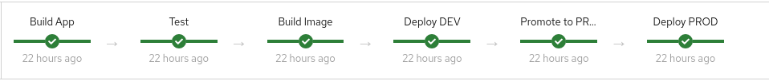
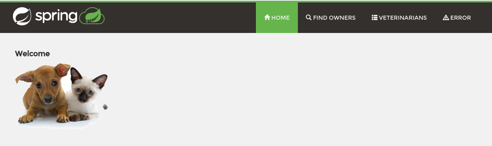

:markup-in-source: verbatim,attributes,quotes

// Title comes from the workshop.yaml
// == Run the Jenkins Pipeline

In this section of the lab you will examine the Jenkins Pipeline and - if you want to - execute the pipeline.

. Open your web browser and navigate to Jenkins at %jenkins_url%.
. Click the blue *Login to OpenShift* button to log into Jenkins. ... Use *%ocp_username%* and your OpenTLC password as credentials.
.. Accept the request for permissions
. On the Jenkins Overview page you will see a folder, *jenkins-%guid%*. Open the folder by clicking on the name.
. You will see a Jenkins task *jenkins-%guid%/petclinic-pipeline*. Open the task by clicking on it.
. On the left click on *Configure* to see the task definition.
.. Notice the 4 parameters that are passed into the pipeline:
* *REPO* (your source code repository for the application you are buildling)
* *PROD_PROJECT*: the name of the project that will hold the production code
* *GITSECRET*: the name of the secret in your Jenkins project that holds the credentials for your _private_ source code repository in Gitea
* *DEV_PROJECT*: the name of the development project

. Scroll down further and examine the Jenkins pipeline. Notice the following:
* The pipeline specifies an agent with label *maven*. This agent pod will execute the pipeline.
* Under *stages* you will find all the stages that make up the pipeline. In each stage you will find a sequence of steps that make up this stage.
* The _Build App_ stage checks out the source code from your private source code repository and uses `mvn install -DskipTests=true` to build the application jar file.
* The _Test_ stage runs `mvn test` and then archives the test results. This makes the test results available on the overview page of your task in Jenkins.
* Stage _Create Builder_ is a bit more complicated. Let's see what's going on:
** First the expression checks if the build configuration *petclinic* exists in your development project.
** If the build configuration does _not_ exists the steps are executed to create a new build configuration of type *binary* with the name *petclinic* using builder image `redhat-openjdk18-openshift:1.8`
* Stage _Build Image_ renames the jar file that you previously built in stage _Build App_ to the name `petclinic.jar` - and then starts the binary build to create the container image for the application. Note the `--wait=true` section: this ensures that this step blocks until the build has finished.
* Stage _Create DeploymentConfig for DEV_ again is a more complicated stage:
** It once again checks if the deployment configuration already exists in the development project. And if it doesn't it creates it using the container image that was just built in the previous step (`petclinic:latest`).
** `expose` creates a route from the service that the `newApp` step created.
** Then it waits until the application has been rolled out by comparing `.spec.replicas` with `.status.readyReplicas` in the deployment configuration object. Note that this logic uses `.object()` to get the current version of the deployment config object. Otherwise it would just keep comparing the state of the object as it was when the variable `dc` was created.
** This stage also sets the triggers in the deployment configuration to *manual* to prevent future automatic deployments and sets a variable to let the next stage (rollout) know that it can be skipped.
** And finally a variable, `devProjectIsNew`, is set to signal that the application has just been deployed. This will prevent a double deploy in the next stage.
* Stage _Deploy Dev_ checks if the project has just been set up. If so there is no need to run a deploy because the previous state already deployed the latest version of the application. It this is the second or higher time the pipeline is run then the previous stage will have been skipped - and it is necessary to roll out (redeploy) the application using the latest container image.
* Stage _Promote to Prod_ tags the image with the `prod` tag.
* Stage _Create DeploymentConfig for PROD_ is similar to the stage that set up the application for the development project.
* Stage _Deploy PROD_ finally is similar to the stage that deployed the application into the development project - except this time it deploys into the production project.
. Now that you know what the pipeline does it's time to run the pipeline.
+
At the top of your screen in the breadcrumb section select the *jenkins-%guid%/petclinic-pipeline* link to get back to the task overview.
. On the left click *Build with Parameters* to kick off a new build. The parameters are already pre-populated so all you have to do is click on the blue *Build* button to kick off a build. You can follow along as the build progresses until it finishes about 4 minutes later. 

=== Access the application

When you ran the Jenkins pipeline this was the first time that it ran. Therefore it created all the resources that it needed to deploy the application to both the development and production projects. Let's check out these applications.

. Make sure the application is running in your development project
+
[source,bash,subs="{markup-in-source}",role=execute]
----
oc get pod -n petclinic-jenkins-%guid%-dev
----
+
.Sample Output
[source,texinfo]
----
NAME                 READY   STATUS      RESTARTS   AGE
petclinic-1-build    0/1     Completed   0          18m
petclinic-1-c77xt    1/1     Running     0          17m
petclinic-1-deploy   0/1     Completed   0          17m
----

. Find the route for the application in your development 
+
[source,bash,subs="{markup-in-source}",role=execute]
----
oc get route -n petclinic-jenkins-%guid%-dev
----
+
.Sample Output
[source,texinfo]
----
NAME        HOST/PORT                                                                    PATH   SERVICES    PORT
 TERMINATION   WILDCARD
petclinic   petclinic-petclinic-jenkins-%guid%-dev.%CLUSTER_SUBDOMAIN%          petclinic   8080-tcp
               None
----

. Use the route (`petclinic-petclinic-jenkins-%guid%-dev.%CLUSTER_SUBDOMAIN%` in the example above) in a web browser to validate that the application is working.
. Also check that the production application is working. First check that the pod is running in your production project (note that you will not see a build pod in this project - you only build the container image in the development project):
+
[source,bash,subs="{markup-in-source}",role=execute]
----
oc get pod -n petclinic-jenkins-%guid%-prod
----
+
.Sample Output
[source,texinfo]
----
NAME                 READY   STATUS      RESTARTS   AGE
petclinic-1-8nrnc    1/1     Running     0          21m
petclinic-1-deploy   0/1     Completed   0          21m
----

. Retrieve the route for the production application.
+
[source,bash,subs="{markup-in-source}",role=execute]
----
oc get route -n petclinic-jenkins-%guid%-prod
----
+
.Sample Output
[source,texinfo]
----
NAME        HOST/PORT                                                                     PATH   SERVICES    PORT
  TERMINATION   WILDCARD
petclinic   petclinic-petclinic-jenkins-%guid%-prod.%CLUSTER_SUBDOMAIN%          petclinic   8080-tcp
                None
----
. Then check that application as well.

Now that you have validated that everything is working as designed you are ready to convert the Jenkins pipeline into an OpenShift pipeline.
