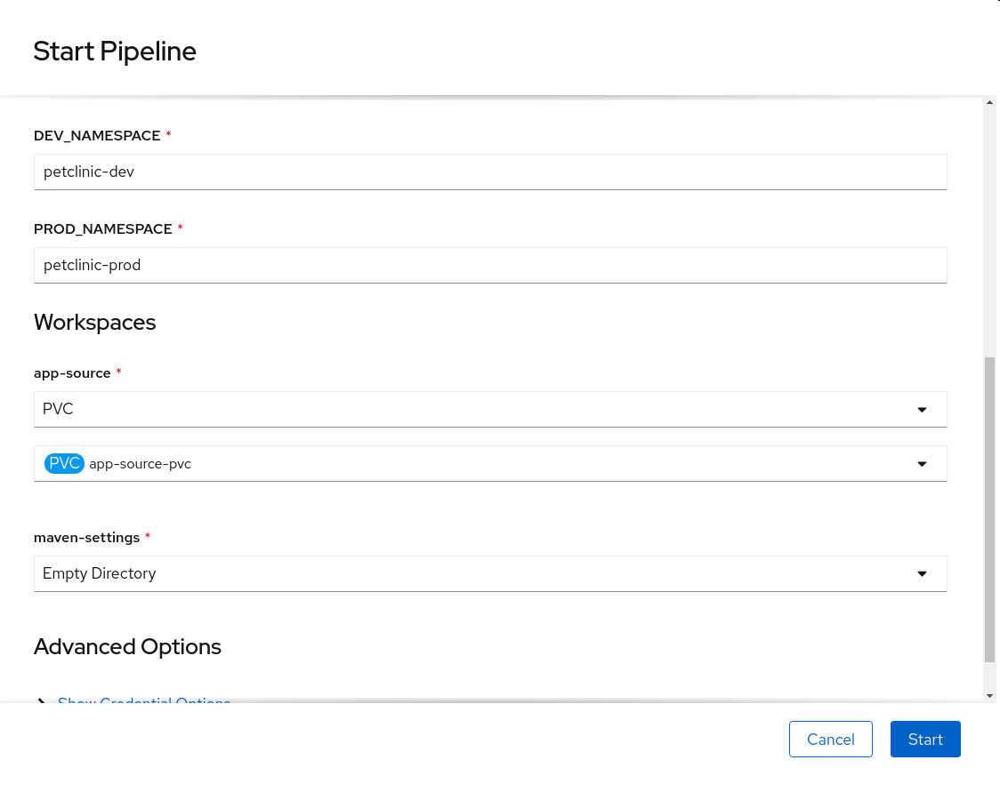

:markup-in-source: verbatim,attributes,quotes

// Title comes from the workshop.yaml
// == Run the OpenShift Pipeline

We created and verified our tasks and we had setup our Pipeline, so now we are ready to start it.

== Run the Pipeline

We can start now our converted Pipeline either from Web Console, than from command line. For both methods, we're going to provide parameters to it.

- *APP_NAME* : name of app deployment, in our case `petclinic`
- *APP_GIT_URL*: git repository URL where to get source code
- *APP_GIT_REVISION*: branch name for git repo
- *APP_IMAGE_STREAM*: the name of the ImageStream with tag for the app
- *DEV_NAMESPACE*: name of target project representing the Dev environment for the app
- *PROD_NAMESPACE*: name of target project representing the Prod environment for the app, where to promote it.

=== Run with Web Console

From Developer Perspective again open `petclinic-pipeline` Pipeline and click on top-right *Actions* drop down list. Then click on *Start*.

image::images/pipeline_action_start.png[Actions Start]

Inside *Workspaces* section, select from *app-source* drop down list *PVC*, then select *app-source-pvc*.
Leave *maven-settings* to *Empty Directory*, since we don't have any custom setting for Maven here.

Finally click on *Start* to run the Pipeline.

Follow execution and logs by clicking on active or executed Tasks:

image::images/pipeline_run.png[Pipeline Running]

Follow logs with `tkn`:

[source,bash,subs="{markup-in-source}",role=execute]
----
tkn pipeline logs
----

=== Run with tkn CLI

You can run the Pipeline directly and watch logs also with `tkn` CLI:

[source,bash,subs="{markup-in-source}",role=execute]
----
tkn pipeline start petclinic-pipeline  \
    --use-param-defaults  \
    -w name=app-source,claimName=app-source-pvc \
    -w name=maven-settings,emptyDir= \
    --showlog \
    -n pipeline-%guid%
----

== Access the Application

image::images/pipeline_successful.png[Pipeline Successful]

If Pipeline is successful, then an image has been pushed into the `pipeline-%guid%-dev` project and a new deployment has been performed. Then the image has been tagged for _prod_ and deployed to `pipeline-%guid%-prod`.

[source,bash,subs="{markup-in-source}",role=execute]
----
oc get pod -n petclinic-%guid%-dev
----
+
.Sample Output
[source,texinfo]
----
NAME                 READY   STATUS      RESTARTS   AGE
petclinic-1-c77xt    1/1     Running     0          17m
petclinic-1-deploy   0/1     Completed   0          17m
----

. Find the route for the application in your development 
+
[source,bash,subs="{markup-in-source}",role=execute]
----
oc get route -n petclinic-%guid%-dev
----
+
.Sample Output
[source,texinfo]
----
NAME        HOST/PORT                                                                    PATH   SERVICES    PORT
 TERMINATION   WILDCARD
petclinic   petclinic-petclinic-nvin-dev.apps.cluster-wkrhtr.red.osp.opentlc.com          petclinic   8080-tcp
               None
----

. Use the route (`petclinic-petclinic-%guid%-dev.apps.cluster-wkrhtr.red.osp.opentlc.com` in the example above in a web browser to validate that the application is working.)
. Also check that the production application is working. First check that the pod is running in your production project (note that you will not see a build pod in this project - you only build the container image in the development project):
+
[source,bash,subs="{markup-in-source}",role=execute]
----
oc get pod -n petclinic-%guid%-prod
----
+
.Sample Output
[source,texinfo]
----
NAME                 READY   STATUS      RESTARTS   AGE
petclinic-1-8nrnc    1/1     Running     0          21m
petclinic-1-deploy   0/1     Completed   0          21m
----

. Retrieve the route for the production application.
+
[source,bash,subs="{markup-in-source}",role=execute]
----
oc get route -n petclinic-%guid%-prod
----
+
.Sample Output
[source,texinfo]
----
NAME        HOST/PORT                                                                     PATH   SERVICES    PORT
  TERMINATION   WILDCARD
petclinic   petclinic-petclinic-nvin-%guid%.apps.cluster-wkrhtr.red.osp.opentlc.com          petclinic   8080-tcp
                None
----
. Then check that application as well.
