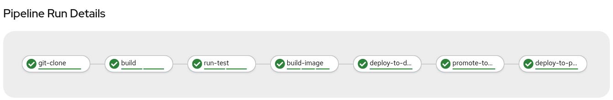

:GUID: %guid%
:OCP_USERNAME: %ocp_username%
:markup-in-source: verbatim,attributes,quotes

== Run the OpenShift Pipeline

Our Pipeline is setup we are ready to start it. Before doing it, we need to ensure that it can access the our private repository.

=== Pipeline Service Account

OpenShift Pipelines provides a service account `pipeline` available for each project. The service account is used to run the pipeline, thus it need to have the right permission to access private repositories and private registries.

==== Private Repository

As Project admin, we can give the right permission to `pipeline` service account in order allow the `git-clone` ClusterTask accessing Gitea with our credentials.

Let's create a Kubernetes `Secret` to attach to `pipeline`:

[source,bash,subs="{markup-in-source}",role=execute]
----
oc create secret generic git-secret --from-literal=username=%ocp_username% --from-literal=password=%gitea_password%
oc annotate secret git-secret "tekton.dev/git-0=https://gitea-gitea.apps.cluster-wkrhtr.red.osp.opentlc.com"
oc secrets link pipeline git-secret
----

Let's verify that the secret has been linked:

[source,bash,subs="{markup-in-source}",role=execute]
----
oc describe sa pipeline -n *pipeline-%guid%
----

You should see something like this:

.Sample Output
[source,options="nowrap",subs="{markup-in-source}"]
----
Name:                pipeline
Namespace:           pipeline-%guid%
Labels:              <none>
Annotations:         <none>
Image pull secrets:  pipeline-dockercfg-k4z7m
Mountable secrets:   pipeline-token-qhq9h
                     pipeline-dockercfg-k4z7m
                     *git-server*
Tokens:              pipeline-token-h5jq6
                     pipeline-token-qhq9h
Events:              <none>
----

==== Private Registry

Our Jenkins Pipeline was able to push built images to _dev_ and _prod_ projects because the `jenkins` service account was already setup with this permission. 
Here we will do the same thing, allowing `pipeline` to push images to petclinic-%guid%-dev and petclinic-%guid%-prod projects.

[source,bash,subs="{markup-in-source}",role=execute]
----
oc project *pipeline-%guid%
oc policy add-role-to-group edit system:serviceaccounts:tekton -n *pipeline-%guid%-dev
oc policy add-role-to-group edit system:serviceaccounts:tekton -n petclinic-%guid%-prod
----

=== Run the Pipeline

We can start now our converted Pipeline either from Web Console, than from command line. For both methods, we're going to provide parameters to it.

- *APP_NAME* : name of app deployment, in our case `spring-petclinic`
- *APP_GIT_URL*: git repository URL where to get source code
- *APP_GIT_REVISION*: branch name for git repo
- *APP_IMAGE_STREAM*: the name of the ImageStream with tag for the app
- *DEV_NAMESPACE*: name of target project representing the Dev environment for the app
- *PROD_NAMESPACE*: name of target project representing the Prod environment for the app, where to promote it.

==== Run with Web Console

From Developer Perspective again open `petclinic-pipeline` Pipeline and click on top-right *Actions* drop down list. Then click on *Start*.

Inside *Workspaces* section, select from *app-source* drop down list *PVC*, then select *app-source-pvc*.
Leave *maven-settings* to *Empty Directory*, since we don't have any custom setting for Maven here.

Finally click on *Start* to run the Pipeline.

image::images/pipeline_start.png[Start Pipeline]

Follow execution and logs by clicking on active or executed Tasks:

image::images/pipeline_run.png[Pipeline Running]

==== Run with tkn CLI

You can run the Pipeline directly and watch logs also with `tkn` CLI:

[source,bash,subs="{markup-in-source}",role=execute]
----
tkn pipeline start petclinic-pipeline  \
    --use-param-defaults  \
    -w name=app-source,claimName=app-source-pvc \
    -w name=maven-settings,emptyDir=
    --showlog
----

=== Access the Application

If Pipeline is successful, then an image has been pushed into the `pipeline-%guid%-dev` project and a new deployment has been performed. Then the image has been tagged for _prod_ and deployed to `pipeline-%guid%-prod`.

[source,bash,subs="{markup-in-source}",role=execute]
----
oc get pod -n petclinic-%guid%-dev
----
+
.Sample Output
[source,texinfo]
----
NAME                 READY   STATUS      RESTARTS   AGE
spring-petclinic-1-c77xt    1/1     Running     0          17m
spring-petclinic-1-deploy   0/1     Completed   0          17m
----

. Find the route for the application in your development 
+
[source,bash,subs="{markup-in-source}",role=execute]
----
oc get route -n petclinic-%guid%-dev
----
+
.Sample Output
[source,texinfo]
----
NAME        HOST/PORT                                                                    PATH   SERVICES    PORT
 TERMINATION   WILDCARD
spring-petclinic   spring-petclinic-petclinic-nvin-dev.apps.cluster-wkrhtr.red.osp.opentlc.com          spring-petclinic   8080-tcp
               None
----

. Use the route (`spring-petclinic-petclinic-%guid-dev.apps.cluster-wkrhtr.red.osp.opentlc.com` in the example above in a web browser to validate that the application is working.)
. Also check that the production application is working. First check that the pod is running in your production project (note that you will not see a build pod in this project - you only build the container image in the development project):
+
[source,bash,subs="{markup-in-source}",role=execute]
----
oc get pod -n petclinic-%guid%-prod
----
+
.Sample Output
[source,texinfo]
----
NAME                 READY   STATUS      RESTARTS   AGE
spring-petclinic-1-8nrnc    1/1     Running     0          21m
spring-petclinic-1-deploy   0/1     Completed   0          21m
----

. Retrieve the route for the production application.
+
[source,bash,subs="{markup-in-source}",role=execute]
----
oc get route -n petclinic-%guid%-prod
----
+
.Sample Output
[source,texinfo]
----
NAME        HOST/PORT                                                                     PATH   SERVICES    PORT
  TERMINATION   WILDCARD
spring-petclinic   spring-petclinic-petclinic-nvin-%guid%.apps.cluster-wkrhtr.red.osp.opentlc.com          spring-petclinic   8080-tcp
                None
----
. Then check that application as well.

